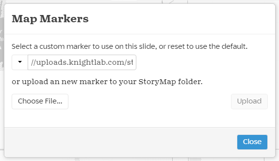
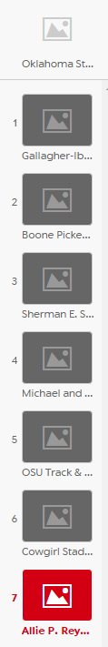
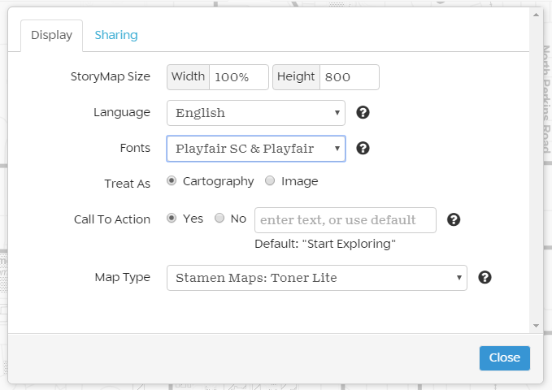
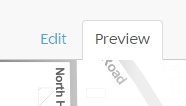
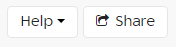

## About
Last Updated *[add date here]*   
Created by [OSU Maps and Spatial Data](https://info.library.okstate.edu/map-room)

## Table of Contents
- Introduction 
- *[StoryMap JS]*
- - Getting Started
- - Making the Story Map
- Conclusion
- Further Reading/Resources

## Introduction
Knight Lab offers a variety of tools, including a StoryMap creator. This is a nice alternative for those who do not have access to esri. 

## *[StoryMap JS]*
StoryMap JS is easy to use and a convenient story map creator.

#### Getting Started
1. To create a Story Map JS, travel to this [website](https://storymap.knightlab.com/).
2. Click **Make a StoryMap**.

3. If prompted, sign into your Google account.
4. Add a title and click **Create**.

5. To create the *Title Page*, add the desired media and information in the bottom half of the screen.

6. To create a new slide, click **Add Slide**.

7. Once again, fill in the desired information.
8. To add a location, enter the address or city name into the search bar and click it. Or you can drag the marker to the desired location.

9. To create a personalized marker, click **Marker Options**.

10. You can choose an already uploaded image or upload a new one.

11. Repeat steps 6-10 as needed.
12. To rearrange slides, just drag and drop them where you would like them in the sidebar.

13. You can edit some appearance features by clicking **Options** and adjusting the tools as desired.

14. You can preview the Story Map by clicking **Preview** and going through the story as a reader.

15. To share, click **Share**, decide on the desired settings and click **Close**.

![Features]

## Conclusion
StoryMap JS offers a simple layout for a story map that is best for linear story-telling.

## Further Reading/Resources

[Return to Top](#about)
